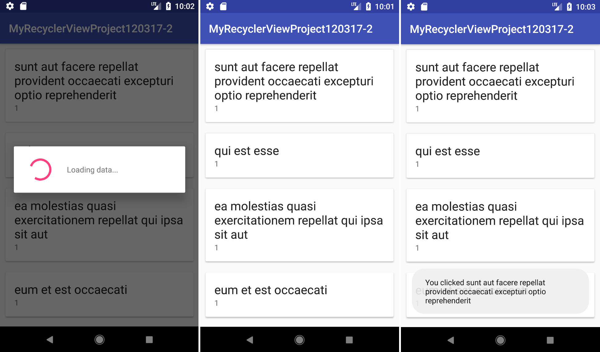
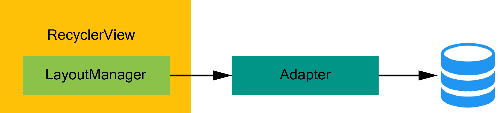

# Android-RecyclerView

<h3>Description</h3>

This project serve as a RecyclerView template to use for basic Text/Image Display with onClick method

<h3>Implementation</h3>
<ol>
<li>Using Volley, <code>loadRecyclerViewData()</code> retrieves JSON object from URL_DATA with GET method.</li>
<li><code>progressDialog</code> show/dismissal happens while data is being loaded.</li>
<li>ListItems are stored as <code>ListItem</code> object. Adapter Class sets View and specified onClickEvent.</li>
  

</ol>
